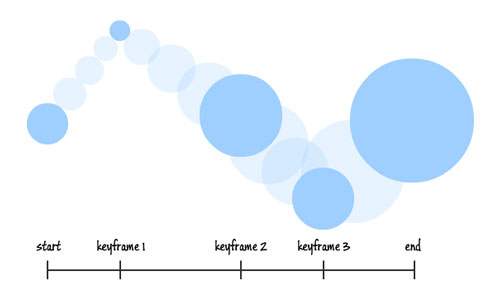

#### 🖥️ 개요
> 키 프레임 애니메이션을 사용하면 두 개 이상의 대상 값을 사용하여 애니메이션 효과를 주고 애니메이션의 \*보간 방법을 제어할 수 있다.

##### * 보간제어 : 해당하는 축들이 일정속도로 동시기동, 동시정지함을 의미.

#### 🖥️ 키 프레임 애니메이션이란?(Key Frame Animation)
> 키 프레임 애니메이션은 컴퓨터 그래픽스에서 사용하는 애니메이션 기법 중 하나이다.
키 프레임 애니메이션의 대상 값은 키 프레임 개체를 사용하며, 애니메이션의 대상 값을 지정하려면 키 프레임 개체를 만들어 이 개체를 애니메이션의 KeyFrames 컬렉션에 추가한다. 이 애니메이션은 실행될 때 지정된 프레임 간에 전환된다.

여러 기법 중 하나인 키프레임 애니메이션은 애니메이션의 동작들을 주요 프레임들로 구성한다. 이후 중간 프레임들은 보간을 통해 계산되어 자연스러운 움직임을 보이게 된다.

키프레임의 생성 단계에서 파일 내부에는 각 프레임의 위치, 회전, 스케일 값을 가지는 정보를 저장한다. 주요 프레임별로 나눠서 저장이 되며 이후 이 프레임들 사이를 보간을 통해서 자연스러운 움직임을 출력한다.

직선 움직임의 경우 `선형 보간`을 사용하고, 곡선 움직임의 경우 `곡선 보간`을 사용하는 경우도 있다.

-----
출처 :   
https://eunsikk.tistory.com/70  
https://learn.microsoft.com/ko-kr/dotnet/desktop/wpf/graphics-multimedia/key-frame-animations-overview?view=netframeworkdesktop-4.8