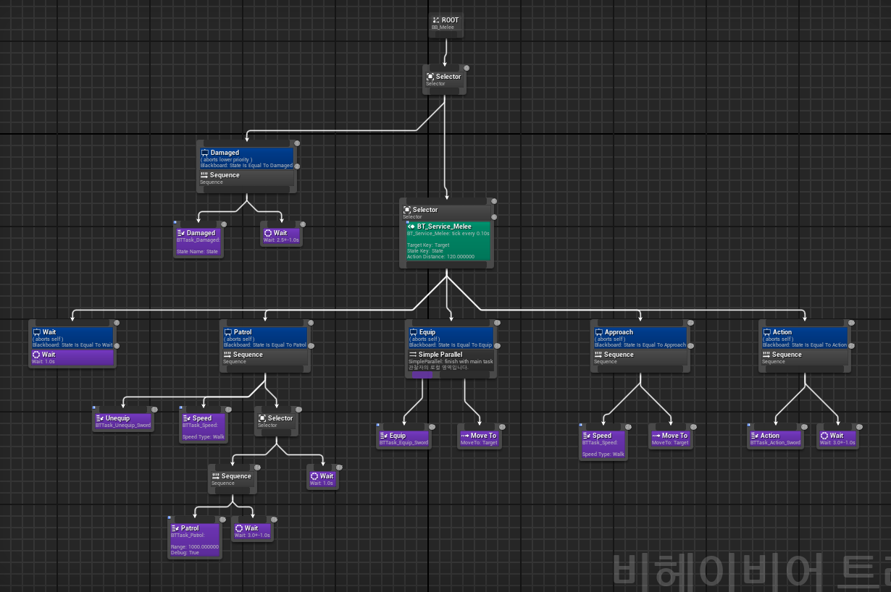

  

----

{:toc}

----
### 🎮 비헤이비어 트리(Behavior Tree)란?
> 언리얼 5에서 비헤이비어 에셋은 프로젝트에서 비플레이어(ex: 적, 몬스터 등) 캐릭터를 위한 인공 지능(AI)을 만드는 데 사용한다.  
AI는 기본적으로 순찰을 하다 플레이어를 인식하면 추격을 한다. 이후 감지를 잃으면 설정된 시간 후에 추격을 포기하고 다시 감지할 때까지 순찰한다.

----
### 🎮 비헤이비어 트리 기본 구성

1. Composite - Tree의 Branch
	- sequence
	- selector
	- simple pareral
 
2. Task - Tree의 Leaf
 
3. Decorator - 조건(중단할건지 말건지). Composite, Task에 붙을 수 있음. 
	- Black Board
		- ★ 관찰자 중단 (Observer aborts) : 해당 조건이 False(중단)가 됐을 때 수행.
			- None : 중단 X
			- Self : 현재 수행하던 행동을 멈추고, 본인과 본인 하위 노드에서 실행 중인 서브 트리 중단. 
			- Lower priority : 자신의 오른쪽 있는 노드(형제)를 중단.
			- Both : 모두, 즉 자신과 그 하위에 실행 중인 서브 트리, 

4. Service - 추가적인 기능 제공. Composite, Task에 붙을 수 있음. 

----
### 🎮 비헤이비어 트리 사용 예시

  

**[근거리 AI Enemy 구조]**

- Root 
	- Selector
		- Damaged 
			- Damaged / Wait
		- Selector - Service
			- Wait / Patrol / Equip / Approach / Action  
&emsp;&emsp;&emsp;&emsp;&emsp;&emsp;&emsp;&emsp;.  
&emsp;&emsp;&emsp;&emsp;&emsp;&emsp;&emsp;&emsp;.  
&emsp;&emsp;&emsp;&emsp;&emsp;&emsp;&emsp;&emsp;.  

----
 출처 :  
＊ https://dev.epicgames.com/documentation/en-us/unreal-engine/behavior-trees-in-unreal-engine?application_version=5.3  
