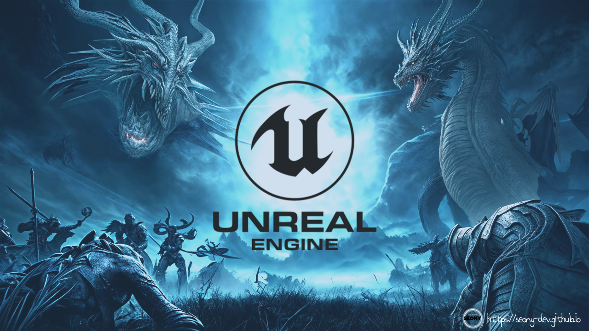
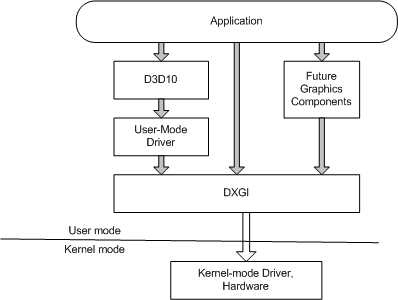

<p align="center">
  
</p>

----

* HAL
* DXGI
* Serialization
* ByteStream
* Endian
* pragma `pack`
{:toc}

----
### 🎮 HAL(Hardware Abstraction Layer; 하드웨어 추상화 계층)이란?
> 하드웨어와 소프트웨어 사이의 추상화 계층. 하드웨어의 차이를 숨겨, 응용 프로그램이 작동할 수 있는 일관된 플랫폼을 제공한다. <br>
OS는 HAL을 다른 하드웨어로 쉽게 이식할 수 있게 해주는 것으로 정의한다.


BSD, 리눅스, 윈도우 NT는 하드웨어 추상화 계층에 기반하고 있으며, 특정한 기능에 대한 하부 시스템을 가지고 있다.
{:.note}

----
### 🎮 DXGI이란?
> Direct3D와 함께 쓰이는 API로 DirectX 그래픽 런타임에 독립적인 저수준(Low-Level)의 작업을 관리하며, DirectX 그래픽을 위한 기본적이고 공통적인 프레임워크를 제공한다. <br>
DXGI의 주요 목표는 DirectX 그래픽 런타임과 독립적일 수 있는 하위 수준 작업을 관리하는 것이다. <br>

※ 그래픽의 일부가 다른 부분보다 더 느리게 진화한다는 것을 인식하여, 향후 그래픽 구성 요소에 대한 공통 프레임워크를 제공함. 즉 DXGI는 **DirectX의 하드웨어 추상 레이어이다.**

<p align="center">
  
</p>

- 목적 : 위 다이어그램과 같이 커널 모드 드라이버 및 시스템 하드웨어와 통신하는 것.

----
### 🎮 직렬화(Serialization)란?
> 언리얼 오브젝트 및 오브젝트 그래프를 하드웨어의 I/O(입출력)을 통해 바이트 스트림으로 변환하는 과정. <br>
↔ 역직렬화(Deserialization) : 직렬화와 반대로, 바이트 스트림에서 오브젝트로 변환하는 과정.

----
### 🎮 바이트 스트림(ByteStream)이란?
>


----
### 🎮 엔디언(Endian)이란?
>


----
### 🎮 pragma pack이란?
> 구조체, 공용 구조체 및 클래스 멤버에 대한 압축 맞춤을 지정한다.

※ 클래스를 압축하려면 멤버를 메모리에 직접 배치해야하는데, 일부 또는 모든 멤버가 대상 아키텍처의 기본 맞춤보다 작은 경계에 정렬될 수 있다. <br>
`pack`은 데이터 선언 수준에서 제어를 제공한다.


#### 구문

```cpp
#pragma pack( show )
#pragma pack( push[ , identifier ] [ ] , n)
#pragma pack( pop [ , { identifier | n } ] )
#pragma pack( [ n ] )
```

#### 매개 변수

**[선택 사항]**
* `show` : 압축 맞춤에 대한 현재 바이트 값을 표시. 경고 메세지에 값이 표시된다.
* `push` : 내부 컴파일러 스택에서 현재 압축 맞춤 값을 `push`하고 현재 압축 맞춤 값을 *n*으로 설정한다. <br>
  * *n*을 지정하지 않으면, 현재 압축 맞춤 값이 `push`된다.
* `pop` : 내부 컴파일러 스택의 맨 위에서 레코드를 제거. *n*을 `pop` 지정하지 않은 경우, 스택 맨 위에 있는 결과 레코드와 연결된 압축 값은 새 압축 맞춤 값이다. <br>
ex) `#pragma pack(pop, 16)`*n*을 지정하면 *n*은 새 압축 맞춤값이 됨.
`#pragma pack(pop, r1)`, 스택을 *identifier* 사용하여 `pop`하는 경우 스택의 모든 레코드는 `identifier` 발견된 레코드까지 `pop`됨. <br>
※ `#pragma pack (pop, r1, 2)` 은 다음에 잇는 `#pragma pack(2)`것과 `#pragma pack (pop, r1)` 같다.
* *identifier* : 사용할 `push`일 경우, 내부 컴파일러 스택의 레코드에 이름을 할당한다. <br>
사용할 `pop`의 경우, 제거될 때까지 *identifier* 내부 스택에서 레코드를 `pop`한다. <br> 
만약 내부 스택에서 찾을 수 없는 경우, *identifier*는 아무 것도 표시 되지 않는다.
* *n* : 압축에 사용할 값(바이트)을 지정. 모듈에 대해 컴파일러 옵션이 **/Zp(구조체 멤버 맞춤)** 설정되어 있지 않은 경우, 기본값 *n*은 8이다. <br>
유효한 값은 1, 2, 4, 8 및 16이며, 멤버의 맞춤은 멤버의 배수 *n* 또는 멤버 크기의 배수 중 더 작은 경계에 있다.

----
<span style="color:darkgray; font-size:14px;"> 출처 : <br>
＊ https://en.wikipedia.org/wiki/Hardware_abstraction <br>
＊ https://learn.microsoft.com/ko-kr/windows/win32/direct3ddxgi/d3d10-graphics-programming-guide-dxgi <br>
＊ https://lipcoder.tistory.com/24 <br>
＊ https://learn.microsoft.com/ko-kr/cpp/c-runtime-library/byte-and-wide-streams?view=msvc-170 <br>
＊ https://en.wikipedia.org/wiki/Endianness <br>
＊ https://learn.microsoft.com/ko-kr/cpp/preprocessor/pack?view=msvc-170 <br>
</span>