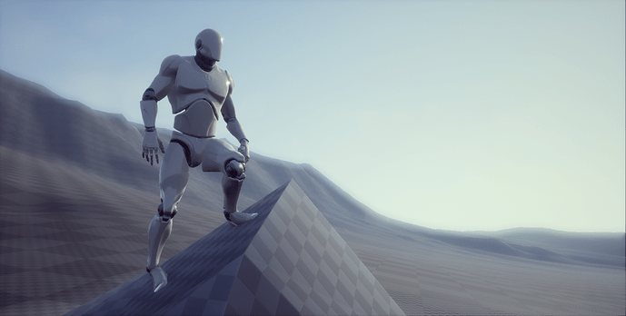
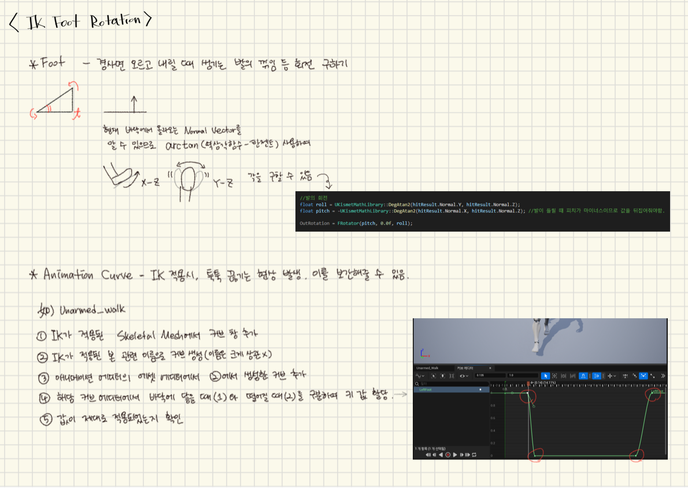
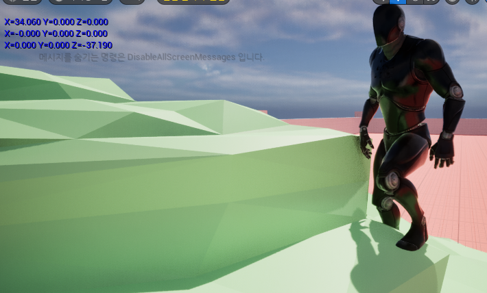

  

 
 이미지 출처 : https://forums.unrealengine.com/t/ik-feet-placement-setup-new-blog/78508  

-----

#### 🎮 개요
> 경사면에 닿는 발의 위치와 회전을 계산하여 캐릭터의 세밀한 동작을 조정할 수 있다.

-----

#### 🎮 IK Foot Rotation 관련 정리

  

##### 결과

  

