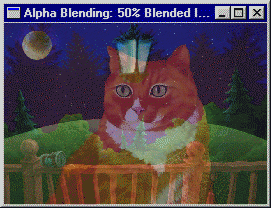

  

 이미지 출처 : http://www.fastgraph.com/help/example_blend.html 

-----

#### 📼 알파 블렌딩(Alpha Blending)이란?

> 알파 합성(Alpha compositing)이라고도 하며, 하나의 이미지를 배경과 결합하여 부분적 또는 전체 투명도를 만드는 프로세스이다.

- 투명 또는 반투명 픽셀이 있는 이미지를 표시할 때 사용된다. 알파 비트맵의 각 픽셀에는 빨간색, 녹색, 파란색(RGB) 색상 채널 외에도 `알파 채널(A)`이라는 `투명도` 구성 요소가 있다.  
알파 채널은 8비트의 경우, 0(전체 픽셀이 투명)~255(전체 픽셀이 불투명)까지 256단계의 투명도를 나타낼 수 있다.  

- 색상은 알파 값을 사용하지 않아도 정의할 수 있으며, 이는 RGB 색상이다. 만약 알파 값을 사용하면 ARGB로 저장된다. 정점, 머터리얼, 텍스처 데이터를 사용해서 객체의 투명도를 제공할 수 있다. (프레임 버퍼 사용시, 투명도 효과를 생성할 수도 있음.)  

* Direct3D 9 기준

----
출처 :  
＊ https://learn.microsoft.com/en-us/windows/win32/direct3d9/alpha-blending  
＊ https://ko.wikipedia.org/wiki/%EC%95%8C%ED%8C%8C_%ED%95%A9%EC%84%B1  
