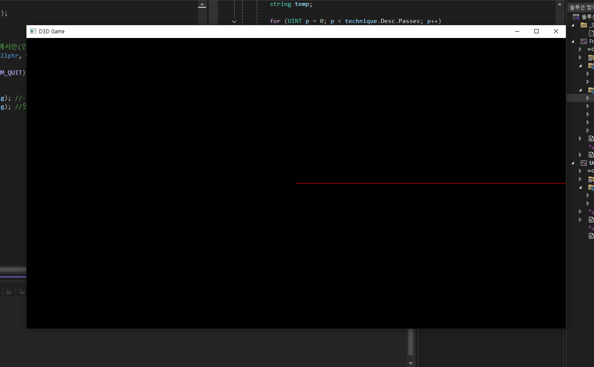

<p align="center">
  
</p>

<!-- <span style="color:darkgray; font-size:14px;"> 이미지 출처 : </span> -->

-----

#### 📼 프로그램 생성 및 시작 프로세스

```cpp
WINAPI WinMain()
{
  Create(); - RegisterClassEx : 윈도우한테 생성할 창을 알려줌. (기본 Window Style) 
            - lpfnWndProc : 윈도우한테 넘겨줄 함수 (모든 메세지는 여기로 전달.)
            - CreateWindowEx : 창을 열어주는 역할. (Window Sub Style) - Handle 생성
            - ShowWindow(Handle) : 만들어진 Handle 창을 화면에 보여주는 역할.
            - SetForegroundWindow(Handle) : 창을 맨 앞에 보여줄 수 있도록 설정.
            - SetFocus : 메세지가 해당 창으로 들어갈 수 있게 선택.
            - ShowCursor : 화면에 커서 보여줄지 말지의 여부

  ★ WndProc(); : 사용자 정의 함수
    - if(WM_KEYDOWN) : 키가 눌렸다면
      - VK_ESCAPE : ESC 버튼.
          PostQuitMessage(0) - Quit 메세지가 들어오면, 정상 종료(마이너스 값이면 비정상 종료) - WM_QUIT 발생.

  Run(); - MSG 초기화

        /// [게임 코드 생성]
        While(true)
        {
          if(PEEK_MESSAGE) //메세지 발생. Window의 메세지 큐(전체 메세지 관리)에서 꺼내옴. 
          {             
              //위의 lpfnWndProc 메세지 큐도 생성됨. 
              if(WM_QUIT) break; //프로그램 종료 - PostQuitMessage에 의해 발생
              
              TranslateMessage() : WM_CHAR에 대한 메세지를 WndProc로 이동 
              DispatchMessageW() : 나머지 윈도우 메세지를 WndProc로 전달.
          }
          else 
          {
            // DX 렌더링. (메세지가 없을 경우)
          }
        }
        /// [게임 코드 종료 - 가비지 컬렉터]

    return msg.wParam; //윈도우 - 최종 메세지 넘겨주기.
}
```

★ 위 프로세스 중에 하나라도 구현 제대로 안 될 경우, **메모리 릭** 발생.