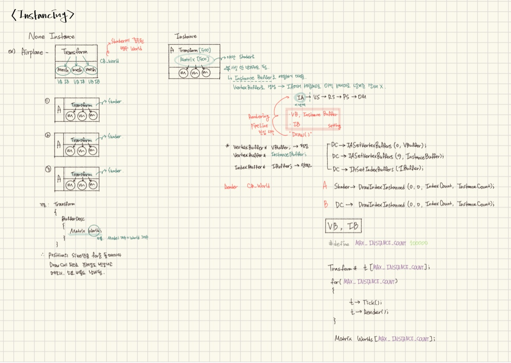

  

&emsp;&emsp;&emsp;&emsp;&emsp;&emsp;&emsp;&emsp; ▲ Vertex Instancing 
 
---

#### 📼 Instancing란?
> 동일한 모델을 효율적으로 렌더링하기 위해 정점 데이터는 공유하고, 변형 정보만 인스턴스 버퍼(Instance Buffer)에 저장하는 것을 의미.

---

#### 📼 Instancing 정리

  

https://blog.nullbus.net/82