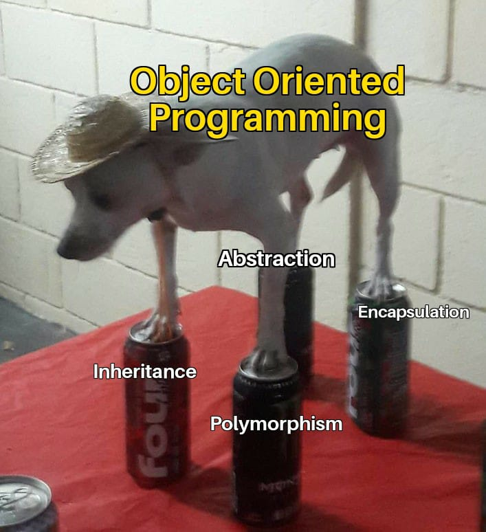

  

-----

#### 🖥️ OOP(Object-Oriented Programming, 객체 지향 프로그래밍)란?

> 데이터와 코드를 포함할 수 있는 `객체` 개념을 기반으로 하는 프로그래밍.
프로그램을 유연하고 비교적 쉬운 변경이 가능하기 때문에 대규모 소프트웨어 개발에 많이 사용된다.
{:.lead}

-----

#### 🖥️ OOP의 기본 구성 요소

- 클래스(Class) : 같은 종류의 집단에 속하는 속성(attribute)과 행위(behavior)를 정의한 것으로 객체지향 프로그램의 기본적인 사용자 정의 데이터형(user defined data type).  

- 객체(Object) : 클래스의 인스턴스(Instance)로, 실제로 메모리상 할당된 것이다. 자신 고유의 속성(attribute)을 가지며, 클래스에서 정의한 행동(behavior)를 수행할 수 있다.  
&emsp; ※ 사람이 말로 표현 가능한 모든 것을 객체라 할 수 있음.

- 메서드(Method), 메시지(Message) : 클래스로부터 생성된 객체를 사용하는 방법으로서 객체에 명령을 내리는 메시지. 객체간의 통신은 메시지로 이루어진다. 

-----

#### 🖥️ OOP의 특징 

RAM은 "휘발성 메모리"이기 때문에 사용 중인 프로그램은 RAM에 일시적으로 로딩되지만, 스토리지 드라이브에는 삭제될때까지 영구적으로 저장된다.

컴퓨터가 프로그램을 실행하거나 작업을 수행할 때 필요한 임시 데이터는 빠르게 접근되어야 한다. 이를 위해 스토리지 장치보다는 RAM에서 데이터를 읽고 쓰는 것이 훨씬 빠르다. 예를들어 최신 PC 게임같은 경우 신속한 art asset 검색이 필수적이기 때문에 RAM을 주로 활용한다.

-----

#### 🖥️ OOP의 장점

> 소프트웨어 공학에서는 소프트 웨어의 질을 향상하기 위해 강한 응집력(Strong Cohesion)과 약한 결합력(Weak Coupling)을 지향한다. 
이러한 점에서 OOP의 경우, 하나의 문제 해결을 위한 데이터를 클래스에 모아 놓은 데이터형을 사용함으로써 **응집력을 강화**하고, 클래스간에 독립적인 디자인을 함으로써 **결합력을 약화**시킨다.
{:.lead}
-----

#### 🖥️ OOP의 5가지 원칙

| 원칙명      | 내용                           |
|------------|:-----------------------------:|
| 단일 책임 원칙(**S**ingle Responsibility Principle) | **하나의 객체는 반드시 하나의 동작만의 책임**을 가짐. |
| 개방-폐쇄 원칙(**O**pen-Closed Principle) | 기존의 코드를 변경하지 않고 기능이나 동작을 추가할 수 있어야하며, 기존의 코드는 안전하게 동작해야한다. 즉 **확장은 개방되고, 변경에는 폐쇄되어야 함.** |
| 리스코프 치환 원칙(**L**iskov Substitution Principle) | 부모 객체를 상속 받은 **자식 객체**는 **부모가 지정한 제약 조건들을 수행**하고, 부모 객체에서 자식 객체로의 **변동**이 일어나도 **부모 객체의 역할을 문제없이 제공**해야함. |
| 인터페이스 분리 원칙(**I**nterface Segregation Principle) | **인터페이스**를 최대한 변경하지 않도록 **구체적으로 구분**해야함. |
| 의존성 역전 원칙(**D**ependency Inversion Principle) | 상위 클래스 및 인터페이스, 또는 추상 클래스를 통해 의존, 즉 구현체보다 **인터페이스나 추상 클래스에 의존**해야함. |

-----

#### 🖥️ OOP 언어

- **C++**, **C#**, Java, Python, Ruby 등.

-----
출처 : 
＊ https://en.wikipedia.org/wiki/Object-oriented_programming  
＊ https://velog.io/@zayson/%EA%B0%9D%EC%B2%B4-%EC%A7%80%ED%96%A5-%ED%94%84%EB%A1%9C%EA%B7%B8%EB%9E%98%EB%B0%8D%EC%9D%98-5%EA%B0%80%EC%A7%80-%EC%9B%90%EC%B9%99-SOLID-%EC%9B%90%EC%B9%99  
＊ https://aspdotnet.tistory.com/3156  
