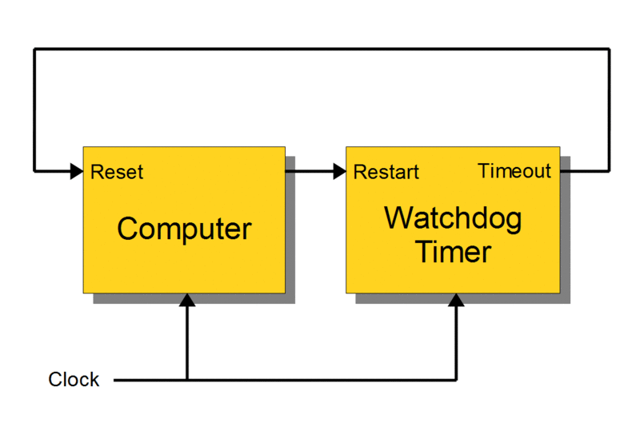
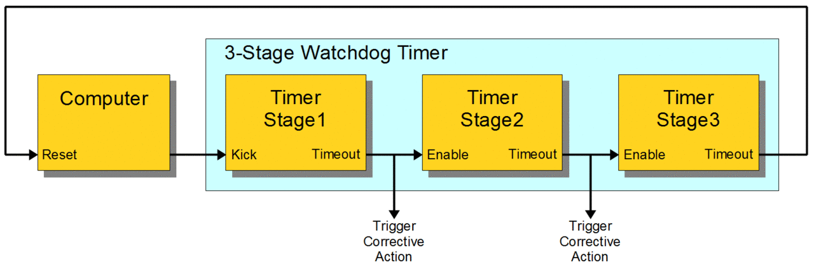
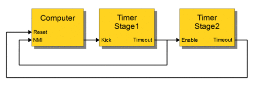

  

-----
#### 🖥️ 워치독 타이머(Watchdog timer)란?
> COP(Computer Operating Properly)라고도 하며, 컴퓨터의 오작동을 탐지하고 복구하기 위해 쓰이는 전자 타이머이다.  
흔히 Windows의 Blue Screen을 예로 들 수 있다.

컴퓨터가 정상 작동할 때, 시간 경과 혹은 `타임아웃`이 되는 것을 막기 위해 정기적으로 워치독 타이머를 재가동 시킨다.  
만약 하드웨어의 결함, 프로그램 오류 등 여러 이슈로 컴퓨터가 워치독을 재가동하는 데 실패하면, 타이머가 시간을 두고 타임 아웃 신호를 생성한다. 
이 타임 아웃 신호는 여러 조치를 취할 때 쓰이며, 일반적으로 컴퓨터 시스템을 안전한 상태로 유지하는 것과 정상적인 시스템 작동으로 원상복귀 시킨다.
{:.note}

----
#### 🖥️ 워치독 타이머의 구조 및 작동

1. 워치독 재시작
	- 보통 `kicking the dog` 이라 불리며, 보통 워치독 제어 포트에 입력을 가해 실행한다.  
&emsp;&emsp; 운영체제가 있는 컴퓨터에서는 일반적으로 장치 드라이버를 통해 워치독 리셋이 작동된다.

2. 단단계 워치독

  

	- 통합된 온칩 워치독을 주로 말하며, 대표적으로 `마이크로 컨트롤러`가 있다.  
&emsp;&emsp; 다른 컴퓨터에서 워치독은 CPU에 직접 연결된 가까운 칩에 있을 수도 있고, 외부 확장 카드에 위치할 수도 있는데, 워치독과 CPU는 일반적으로 클릭 신호를 공유할 수 있고, 독립적인 클럭 신호들을 가지고 있을 수도 있다.	
	- **단순히 컴퓨터를 재시작**할 때 쓰인다.

3. 다단계 워치독

  

	- 둘 또는 그 이상의 타이머들을 차례로 이어서 붙여 사용할 수 있다. 이떄 각 타이머는 `타이머 단계` 혹은 `단계`로 불린다.  
&emsp;&emsp; 다단계 워치독에서 오직 제 1단계만 프로세서에 의해 실행되고, 타임아웃시 시정 조치가 취해진다.  
&emsp;&emsp; 이후 다단계의 다음 단계가 시작되며 각 후속 단계가 타임아웃되면 시정 조치가 수행되고 다음 단계가 실행된다.  
&emsp;&emsp; 마지막 단계가 타임아웃하면, 시정 조치가 취해지고 더이상 단계는 시작되지 않는다.
	- 차례로 시정 조치를 작동시키고 **마지막 단계에서 컴퓨터를 재시작**한다.

4. 시간 간격
	- 고정되거나 프로그래밍할 수 있는 시간 간격이 존재하며, 일부 워치독 타이머들은 몇 가지 선택 가능한 이산값들 중에서 시간 간격을 설정함으로써 이를 프로그램 되도록 한다.  
&emsp;&emsp; 다른 경우에는, 임의의 값으로 프로그램될 수 있는데 일반적으로 10밀리초 ~ 1분 이상 다양한 간격으로 구성되고 각 타이머는 자신만의 고유한 시간 간격을 가질 수 있다.  

----
#### 🖥️ 시정 조치

  

> `프로세서 리셋`, `차단 불가능 인터럽트`, `차단 가능 인터럽트`, `전원 껐다 켜기`, `안전모드 상태 활성화` 또는 이들의 조합을 포함하는 몇 가지 유형이 존재한다.  
워치독 타이머는 종종 오류 복구시 유용할 수 있는 시스템 상태정보 혹은 디버그 정보를 영구 저장매체에 기록할 때 사용한다.

----
#### 🖥️ 오류 검출
> 컴퓨터는 하나 또는 그 이상의 오류 검출 테스트를 실시하여 시스템이 가동하는지를 확인하고 모든 테스트를 통과한 경우에만 워치독을 가동시킨다.  
하지만 컴퓨터가 감지하기 힘든 오류상태를 탐지하는데 실패하여 워치독을 실행시키지 않을 수도 있으며, 시정 조치 중 `소프트웨어 재시작`은 오류로 인해 실패할 가능성이 있기 때문에 하드웨어 타이머를 사용하는 예방책을 가지는 것이 중요하다.

----
출처 :  
＊ https://ko.wikipedia.org/wiki/%EC%9B%8C%EC%B9%98%EB%8F%85_%ED%83%80%EC%9D%B4%EB%A8%B8  
