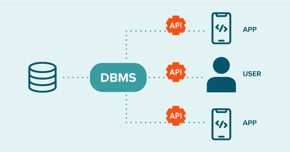

  
    

  

-----  

이미지 출처: https://www.quest.com/learn/what-is-a-database-management-system.aspx   

----

### 📚 DBMS(Database Management System)란?
> 데이터베이스를 효율적으로 관리하고 운영하기 위한 소프트웨어. 사용자는 DBMS를 통해 데이터를 생성, 수정, 삭제, 검색할 수 있으며, 다수의 사용자가 동시에 데이터를 안전하게 처리할 수 있음.

---

### 📚 DBMS의 주요 기능
- **데이터 저장 및 관리**: 데이터를 구조적으로 저장하고 관리할 수 있도록 지원.
- **데이터 검색 및 조작**: SQL 등의 쿼리를 사용하여 데이터를 검색하고 변경할 수 있음.
- **동시성 제어**: 다수의 사용자가 동시에 데이터를 조작할 때 충돌을 방지.
- **보안 및 접근 제어**: 사용자 권한을 설정하여 데이터 접근을 제한.
- **백업 및 복구 기능**: 데이터 손실을 방지하기 위한 백업 및 복구 기능 제공.

---

### 📚 DBMS의 주요 유형

**1. 관계형 데이터베이스 관리 시스템(RDBMS)**
- **특징**: 테이블 기반의 데이터 저장 방식, SQL을 사용하여 데이터 조작.
- **장점**: 데이터 무결성 보장(ACID), 구조적 데이터 관리에 최적화.
- **대표적인 DBMS**: 오라클(Oracle), MySQL, PostgreSQL, Microsoft SQL Server

**2. 비관계형 데이터베이스 관리 시스템(NoSQL)**
- **특징**: 문서(Document), 키-값(Key-Value), 컬럼(Column), 그래프(Graph) 등 다양한 데이터 모델 지원.
- **장점**: 스키마가 고정되지 않아 유연성이 높으며, 대규모 데이터 처리에 적합.
- **대표적인 DBMS**: MongoDB, Redis, Firebase, Cassandra

---

### 📚 DBMS 선택 기준 

**1. 성능 및 확장성** 
- 높은 트래픽과 동시 접속이 많은 환경에서는 **NoSQL**이 유리함
- 대규모 데이터 저장과 빠른 검색을 위해 **인덱싱 및 샤딩(Sharding) 지원 여부 고려**

**2. 데이터 구조 및 관리 방식** 
- **정형 데이터**(사용자 계정, 결제 정보 등)는 **RDBMS**가 적합
- **비정형 데이터**(로그 데이터, 실시간 채팅 등)는 **NoSQL**이 유리

**3. 트랜잭션 관리(ACID 지원 여부)** 
- 금융 서비스, 게임 내 결제, 아이템 거래 등 **데이터 일관성이 중요한 경우**는 RDBMS 선택
- 반면, 실시간 데이터 스트리밍 등에서는 **BASE(NoSQL) 모델이 더 유연함**

**4. 운영 및 유지보수 비용** 
- **오픈 소스 DBMS**(MySQL, PostgreSQL, MongoDB)는 비용 절감 가능
- **기업용 DBMS**(Oracle, Microsoft SQL Server)는 고급 기능과 지원을 제공하지만 비용이 높음

---

## 📚 DBMS 활용 사례  

| 사용 사례 | 추천 DBMS |
|----------|----------|
| 대규모 금융 시스템 | Oracle, PostgreSQL |
| 중소형 웹 서비스 | MySQL, PostgreSQL |
| 실시간 채팅 및 스트리밍 | MongoDB, Firebase |
| 캐싱 및 세션 저장 | Redis |
| IoT 및 빅데이터 처리 | Cassandra |

---

## 📚 최종 정리
> DBMS는 데이터 저장과 관리를 위한 필수적인 기술이며, 프로젝트의 요구 사항에 따라 **RDBMS와 NoSQL** 중 적절한 유형을 선택하는 것이 중요.  
데이터 구조, 성능, 비용, 확장성을 종합적으로 고려하여 적합한 DBMS를 선택해야 한다.

---

## 📚 출처
- [데이터베이스 이해하기: Database(DB), DBMS, SQL의 개념](https://hongong.hanbit.co.kr/%EB%8D%B0%EC%9D%B4%ED%84%B0%EB%B2%A0%EC%9D%B4%EC%8A%A4-%EC%9D%B4%ED%95%B4%ED%95%98%EA%B8%B0-databasedb-dbms-sql%EC%9D%98-%EA%B0%9C%EB%85%90/)
- [DBMS 정의, 기능 그리고 유형](https://fiveangels.tistory.com/entry/%EC%BB%B4%ED%93%A8%ED%8C%85-%EA%B8%B0%EC%B4%88-DBMS-%EC%A0%95%EC%9D%98-%EA%B8%B0%EB%8A%A5-%EA%B7%B8%EB%A6%AC%EA%B3%A0-%EC%9C%A0%ED%98%95)
- [Comparison of relational database management systems](https://en.wikipedia.org/wiki/Comparison_of_relational_database_management_systems)
- [Quest: What is a Database Management System?](https://www.quest.com/learn/what-is-a-database-management-system.aspx)

