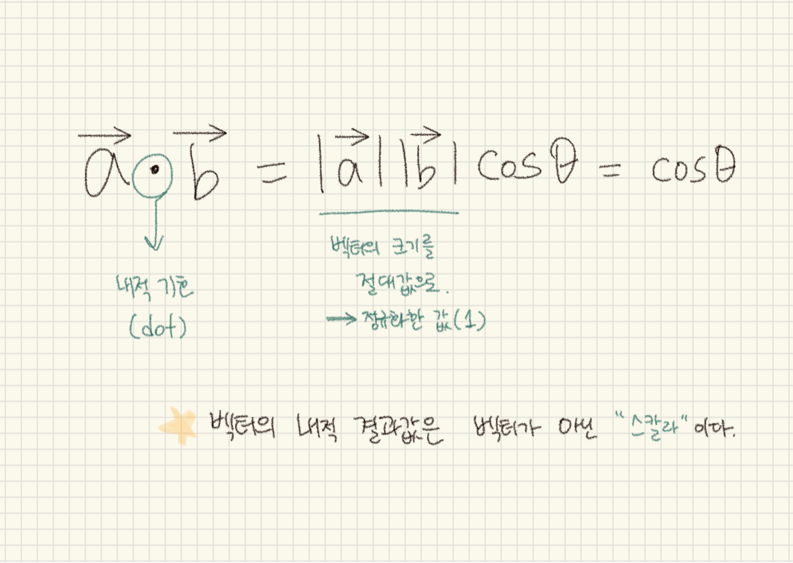

#### 📈 들어가기 전...
_**벡터를 사용하는 이유**_

1. GameObject들의** 속도, 바람, 저항, 충돌, 위치 판단** 등 많은 요소들을 벡터로 표현할 수 있다.

2. `벡터의 내적`을 이용해서 오브젝트 위치의 전·후방을 판별할 수 있다. **플레이어의 시선(forward) 중심**으로 **좌, 우 90도가 넘어가는 순간** `코사인 값`은 `음수`를 갖기 때문에, 플레이어 시선의 벡터와 target의 위치벡터를 내적해서 양수값이면 플레이어의 전방, 음수값이면 플레이어의 후방에 위치한다.
3. `벡터의 외적`은 보통 오브젝트 위치의 좌우를 판별하는데 사용된다. 플레이어의 시선과 Up 벡터를 중심으로 외적을 구한다면 플레이어의 좌측에 있는 오브젝트는 양수, 플레이어의 오른쪽에 있는 오브젝트는 음수를 반환한다.

#### 📈 벡터란?

  

##### &nbsp;&nbsp;&nbsp;&nbsp;&nbsp;&nbsp;&nbsp;&nbsp;&nbsp;&nbsp;&nbsp;&nbsp;&nbsp;&nbsp;&nbsp;&nbsp;&nbsp;&nbsp;&nbsp;&nbsp;&nbsp;&nbsp;&nbsp;&nbsp;&nbsp;&nbsp;&nbsp;&nbsp;&nbsp;&nbsp;&nbsp;&nbsp;&nbsp;&nbsp;&nbsp;&nbsp;↑ 벡터는 점 A와 점 B를 잇는 화살표이다.

> 벡터는 그리스 수학자인 '유클리디안 벡터(Euclidean vector)'의 이름을 따랐으며, 기하학적 벡터(geometric vector)라고도 불린다. 
이는 크기와 방향을 모두 가지는 어떤 양으로 정의되며, 사물의 움직임을 프로그래밍하기 위한 가장 기본적인 구성요소이다. 
일반적으로 벡터는 `화살표`로 표현한다. `화살표가 가리키는 쪽`은 `방향`을 나타내며 `화살표의 길이`는 `크기`를 나타낸다.

-----

#### 📈 벡터의 내적(內積; inner product)

  

내적은 벡터를 곱하는 개념 중 하나인데, 이는 '쌓을 적(積)'이라는 한자로 표현된다. 이는 **두 벡터의 방향이 일치하는 정도에 따라서 곱을 한다.** 
예를 들어, **두 벡터의 방향이 완전히 일치**하면 **각 벡터의 크기를 그냥 곱**하고, **두 벡터가 이루는 각이 90도**일 땐, **일치하는 정도가 전혀 없기 때문에 곱이 0**이 된다. 
즉 내적은 하나의 벡터를 다른 벡터로 _\* 정사영_ 시켜서 그 벡터의 크기를 곱하는 것으로 이해할 수 있다. 

  

내적의 값을 구하는 수식은 두 벡터 사이에 기호로 가운데 점(dot)을 찍는 것( · )이며, 이는 벡터a와 b의 절대값을 곱하고 코사인 세타 값을 곱하면 된다.

##### \* 정사영(Orthogonal Projection) : 한 벡터를 다른 벡터에 수직으로 내린 선상에 있는 점을 찾는 것을 말한다. 즉 정사영은 두 벡터 사이의 각도와 관련이 있으며, 이를 통해 한 벡터를 다른 벡터의 방향으로 투영시키는 것이라 볼 수 있다.
-----
#### 📈 벡터의 외적(外積; outer product)

  

두 벡터를 곱하는 내적 외에 외적도 존재한다. 외적의 결과값은 벡터이며, 이 `벡터의 방향`은 **곱하는 두 벡터에 수직**하고 `크기`는 **두 벡터가 이루는 평행사변형의 넓이이다.**
내적의 연산 기호는 닷(dot; ·)을 사용하며, 수식은 벡터a와 b의 절대값을 곱하고 코사인 세타 값을 곱하면 된다.
외적의 연산 기호는 크로스(cross; χ )이며, 수식은 각 벡터의 외적의 크기(절대값)를 곱하고 사인 세타 값을 곱하면 된다.

-----
#### 📈 내적과 외적의 차이
수학적으로 접근한다면 내적과 외적은 서로 상관이 없다. 즉 두 가지 형태의 다른 연산이 존재하는 것이라 볼 수 있다.
다만 `내적의 결과값`은 **`스칼라`**이고, `외적의 결과값`은 **`벡터`**이다.

위에서 서술한 것과 같이 게임 프로그래밍에서 바라보는 벡터의 내적과 외적은 다소 차이가 있다. 
내적은 0~180도 사이에서만 구할 수 있기 때문에 전·후방 값만 알 수 있으며, 반대로 외적은 중앙(0)을 기준으로 좌(-1)·우(1) 값을 알 수 있다. 즉 내적과 외적을 함께 쓰게 되면 360도 위치와 방향을 구현할 수 있다.
(해당 부분은 다시 정리)

-----
출처 :
- [칸 아카데미 - 벡터란?](https://ko.khanacademy.org/computing/computer-programming/programming-natural-simulations/programming-vectors/a/intro-to-vectors)  
- https://wikidocs.net/22384  
- https://amirazmi.net/dot-products-in-games-and-their-use-cases/  
- https://gnaseel.tistory.com/18#google_vignette  