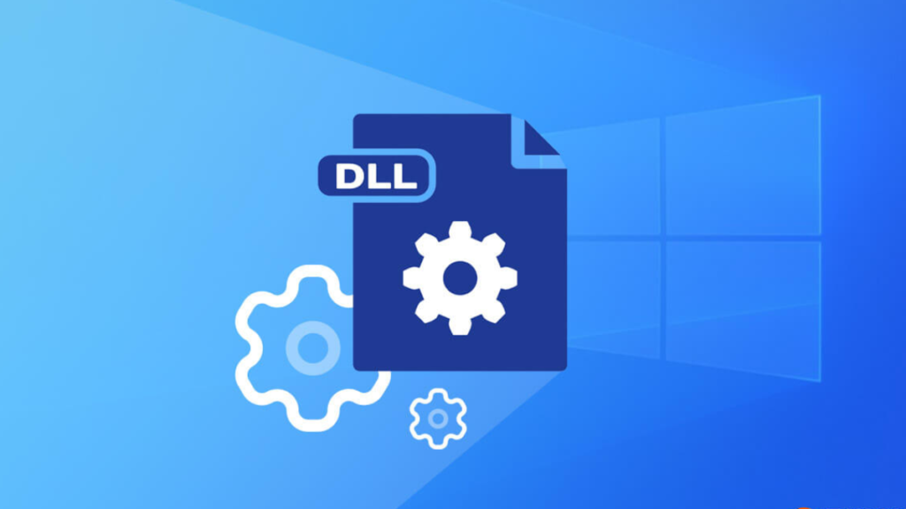

### 🖥️ 라이브러리(Library)이란?
>소프트웨어 개발에서 자주 쓰고 기초적인 함수들을 중복 개발하는 것을 피하기 위해 표준화된 함수 및 데이터 타입을 만들어서 모아 놓은 것.
즉, 자주 사용되는 표준적인 함수를 미리 만들어서 모음으로써, 개발 속도도 빨라지고 신뢰성도 확보할 수 있음. 

-----

### 🖥️ 정적 링크(Static Link)와 동적 링크(Dynamic Link)

라이브러리는 언제 메인 프로그램에 연결하느냐에 따라서 '정적 링크(Static Link)'와 '동적 링크(Dynamic Link)'로 나뉨.

- **정적 링크** : 컴파일 시점에 라이브러리가 링커에 의해 연결되어 실행 파일의 일부분이 됨.
- **동적 링크** : 실행 파일에서 해당 라이브러리의 기능을 사용 시에만, 라이브러리 파일을 참조하여(혹은 다운로드) 기능을 호출.
**정적링크와는 달리, 컴파일 시점에 실행 파일에 함수를 복사하지 않고 함수의 위치정보만 갖고 그 함수를 호출할 수 있게 함.**

_★ **DLL**의 경우, **동적 링크**에 속함. _

-----

### 🖥️ DLL(Dynamic Link Library)이란?
> '동적 연결 라이브러리'라고도 불리며, 다양한 애플리케이션과 프로그램이 특정 작업을 수행하기 위해 호출할 수 있는 지침과 지시를 포함하는 일종의 레코드.
쉽게 말해, 위에서 설명한 동적 링크들을 모아놓은 것을 의미함.

-----
### 🖥️ DLL 종속성 
프로그램이나 DLL이 다른 DLL의 DLL 함수를 사용하는 경우 종속성이 작성됨.
이런 경우 해당 프로그램은 더 이상 자체 포함 프로그램이 아니며, **종속성이 손상되면 프로그램에 문제가 발생**할 수 있음.

>
1. 종속 DLL을 **새 버전으로 업그레이드**하는 경우
2. 종속 DLL을 **수정**하는 경우
3. 종속 DLL을 **이전 버전으로 덮어쓰는** 경우
4. 종속 DLL을 **컴퓨터에서 제거**하는 경우

이러한 작업을 대개 **DLL 충돌**이라고 하고, 이전 버전과의 **호환성**이 적용되지 
않으면 프로그램이 정상적으로 실행되지 않을 수 있음.

하지만 최근, '.NET Framework'가 도입됨에 따라 어셈블리를 사용하게 되어 대부분의 종속성 문제는 해결되었음.

-----
### 🖥️ DLL의 장점

**[장점]**

DLL을 사용하면 **효율적으로 코드를 모듈화**하고 **재사용**할 수 있으며, 메모리 사용 효율성을 높이고 사용되는 디스크 공간을 줄일 수 있음. 
따라서 **운영 체제와 프로그램이 더 빠르게 로드 및 실행**되며 **컴퓨터에서 더 적은 디스크 공간을 차지**함.

-----
### 🖥️ 프로그램에 DLL 연결 방법

1. **컴파일 타임** 동안 링커는 프로그램에 필요한 모든 심볼(함수, 변수 등)이 프로그램에 연결되었는지 또는 공유 라이브러리 중 하나에 **연결되었는지 확인**함.

2. 동적 라이브러리의 개체 파일은 실행 파일에 삽입되지 않으며, 대신 프로그램이 시작되면 시스템의 프로그램(동적 로더라고 함)이 어떤 공유 라이브러리가 프로그램에 링크되었는지 확인 후, 이를 메모리에 로드하고 메모리에 있는 프로그램의 사본에 첨부함.

-----
### 🖥️ DLL과 EXE 파일의 비교
- .dll : 기본적으로 공유 라이브러리이고 실제로는 단독으로 실행할 수 없음. 
- .exe : **DLL과 함께 실행되고** DLL에 리소스를 제공하기 위해 선택되는 실행 파일.

DLL을 직접 실행하는 것은 운영 체제가 진입점을 통해 로드하기 위해 EXE가 필요하기 때문에 불가능함. 
따라서 RUNDLL.EXE또는와 같은 유틸리티가 존재함. → **_.RUNDLL32.EXE_**

-----

 출처 :  
https://learn.microsoft.com/ko-kr/troubleshoot/windows-client/setup-upgrade-and-drivers/dynamic-link-library 
https://www.dignited.com/99963/what-is-a-dynamic-link-library-dll-file-in-windows/  
https://goddaehee.tistory.com/185 
