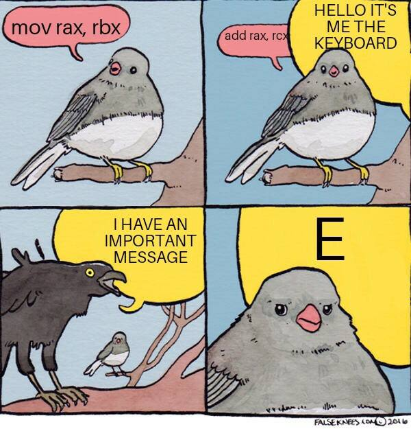

#### 🖥️ 인터럽트(Interrupt)란?

> CPU가 프로그램을 실행하고 있을 때 예외상황이 발생해 처리가 필요할 경우 현재 실행중인 작업을 중단하고 발생된 상황을 처리한 뒤 다시 실행중인 작업으로 복귀하는 것을 말함.

입출력 연산이 CPU 연산 수행속도보다 현저히 느리기 때문에 사용. 
I/O 연산이 끝난 이후 I/O Device는 인터럽트를 통해 CPU에게 알리고, CPU는 I/O 연산 결과를 이용해 작업을 완료함. 

#### 🖥️ 인터럽트의 종류

* 외부 인터럽트: 입출력 장치, 타이밍 장치, 전원 등의 외부적인 요인에 의해서 발생하는 인터럽트.
	- 전원 이상 인터럽트: 정전이나 전원이 이상이 있는 경우
	- 기계 고장 인터럽트: CPU등의 기능적인 동작 오류가 발생한 경우
	- 입출력 인터럽트(I/O Interrupt): 입출력의 종료 등의 이유로 CPU의 수행을 요청하는 인터럽트.

* 내부 인터럽트: 잘못된 명령이나 데이터를 사용할 때 발생하는 인터럽트
	- 0으로 나누는 경우
	- 오버플로우 또는 언더플로우가 발생한 경우
	- 프로그램 상의 오류
	- 프로그램에서 함수 등 명령어를 잘못 사용한 경우
	- 예외를 처리하던 중 또 다른 예외가 발생할 경우, Double Fault이라고 부른다. Double Fault가 발생하여 이를 처리하는 중에 또 다른 예외가 발생할 경우, Triple Fault라고 부르며 이 경우 CPU Reset가 발생한다.
	- 소프트웨어 인터럽트: CPU가 인스트럭션을 수행하는 도중에 일어나는 인터럽트

----
출처 :   
https://nice-engineer.tistory.com/entry/%EC%9A%B4%EC%98%81%EC%B2%B4%EC%A0%9C-%EC%9D%B8%ED%84%B0%EB%9F%BD%ED%8A%B8Interrupt#recentComments