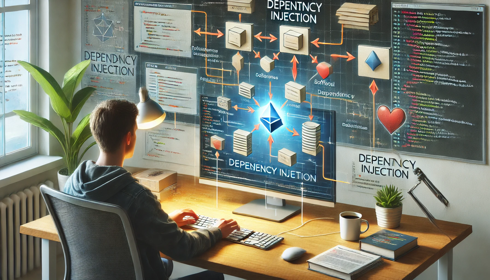

### 🖥️ DI(Dependency Injection)이란?
> 소프트웨어 공학에서 객체 또는 함수가 내부적으로 생성하는 대신 필요한 다른 객체 또는 함수를 수신하는 프로그래밍 기술이며, 이는 객체가 필요한 것을 스스로 만들지 않고, 외부에서 받아서 사용하는 방식이다.

-----
### 🖥️ DI와 IoC의 관계성
> **제어 반전(Inversion of Control, IoC)**은 애플리케이션의 흐름을 개발자가 아닌 외부 시스템이 맡는 개념이며, DI는 그 방법 중 하나이다.
보통 객체는 자신이 필요한 것들을 스스로 만들지만, 제어 반전에서는 그 일을 외부에서 대신한다. 즉, 객체가 필요로 하는 것을 외부에서 주입받는 방식인 DI와 IoC는 서로 밀접하게 연결되어 있다.

-----
#### 🖥️ DI의 장·단점

**[장점]**

1. **모듈성과 재사용성 높아짐**
   - 코드가 인터페이스에 의존해서 구현체를 쉽게 교체 가능.
   - 각 구성 요소를 독립적으로 개발하고 테스트할 수 있음.

2. **유지보수성 좋음**
   - 의존성이 명시적으로 관리돼서 코드 구조가 투명하고 이해하기 쉬움.
   - 변경 사항이 생겨도 다른 구성 요소에 미치는 영향 최소화됨.

3. **테스트 용이**
   - 의존성 주입으로 Mock이나 Stub을 이용한 단위 테스트가 쉬워짐.
   - 테스트 시 실제 구현 대신 가짜 객체를 사용해서 테스트 성능 향상.

4. **결합도 낮음**
   - 클라이언트가 구체적인 구현이 아닌 추상화에 의존하므로 클래스 간 결합도가 낮음.
   - 코드 변경으로 인한 영향이 줄어듦.

5. **확장성 및 유연성 좋음**
   - 새로운 기능 추가 시 기존 코드 수정 없이 새로운 의존성만 주입하면 됨.

---

**[단점]**

1. **복잡성 증가**
   - DI 컨테이너나 프레임워크 사용 시 설정 및 학습이 번거로워짐.
   - 작은 프로젝트에서는 과한 방식일 수 있음.

2. **디버깅 어려움**
   - 런타임에 의존성 주입되므로 문제가 발생하면 추적하기 어려움.

3. **성능 저하**
   - DI 컨테이너 사용 시 의존성 생성과 주입이 런타임에 이루어져 미세한 성능 저하 발생할 수 있음.

4. **코드 가독성 떨어짐**
   - 의존성 주입 과도하게 사용하면 생성자나 메서드에 매개변수가 많아져서 코드가 복잡해짐.
   - DI 컨테이너 없이 수동으로 주입하면 코드가 장황해짐.

5. **구현 이해 어려움**
   - DI 패턴을 처음 접하거나 경험이 부족한 개발자에게는 개념과 적용 방법이 어려움.


>의존성 주입은 **확장성, 테스트 용이성** 등 장점이 있지만, **작은 프로젝트**에서는 복잡성을 증가시킬 수 있음. 상황에 맞게 적절히 적용하는 게 중요함.

-----
### 🖥️ DI 예시 (C#)
```cs
using System;

namespace DependencyInjection;

// 클라이언트는 이 인터페이스에 대해서만 알 수 있으며, 어떤 특정 게임패드를 사용하는지는 알지 못함.
interface IGamepadFunctionality {
    string GetGamepadName(); // 게임패드 이름을 반환
    void SetVibrationPower(float power); // 진동 세기를 설정
}

// 다음 서비스들은 위의 인터페이스에 대한 구체적인 구현을 제공.
class XboxGamepad : IGamepadFunctionality {
    float vibrationPower = 1.0f; // 진동 세기 기본값

    // Xbox 게임패드의 이름 반환
    public string GetGamepadName() => "Xbox controller";

    // 진동 세기를 설정하며, 0.0에서 1.0 사이로 클램핑
    public void SetVibrationPower(float power) => this.vibrationPower = Math.Clamp(power, 0.0f, 1.0f);
}

class PlaystationJoystick : IGamepadFunctionality {
    float vibratingPower = 100.0f; // 진동 세기 기본값

    // PlayStation 게임패드의 이름 반환
    public string GetGamepadName() => "PlayStation controller";

    // 진동 세기를 설정하며, 0.0에서 100.0 사이로 클램핑 (입력 값에 100을 곱함)
    public void SetVibrationPower(float power) => this.vibratingPower = Math.Clamp(power * 100.0f, 0.0f, 100.0f);
}

class SteamController : IGamepadFunctionality {
    double vibrating = 1.0; // 진동 세기 기본값

    // Steam 게임패드의 이름 반환
    public string GetGamepadName() => "Steam controller";

    // 진동 세기를 설정하며, 0.0에서 1.0 사이로 클램핑
    public void SetVibrationPower(float power) => this.vibrating = Convert.ToDouble(Math.Clamp(power, 0.0f, 1.0f));
}

// 이 클래스는 서비스를 제공받는 클라이언트 역할을 함.
class Gamepad {
    IGamepadFunctionality gamepadFunctionality; // 의존성으로 제공받은 인터페이스를 저장

    // 서비스는 생성자를 통해 주입되며, 위 필드에 저장됨.
    public Gamepad(IGamepadFunctionality gamepadFunctionality) => this.gamepadFunctionality = gamepadFunctionality;

    public void Showcase() {
        // 주입된 서비스를 사용
        var gamepadName = this.gamepadFunctionality.GetGamepadName(); // 게임패드 이름 가져오기
        var message = $"We're using the {gamepadName} right now, do you want to change the vibrating power?";
        Console.WriteLine(message);
    }
}

class Program {
    static void Main() {
        var steamController = new SteamController();

        // XboxController, PlaystationJoystick 등 다른 구현체도 전달 가능
        // Gamepad는 어떤 구현체를 사용하는지 몰라도 됨.
        var gamepad = new Gamepad(steamController);

        gamepad.Showcase(); // 게임패드 상태 출력
    }
}

```

-----

<span style="font-size:14px; color:darkgray;"> 출처 : <br>
https://en.wikipedia.org/wiki/Dependency_injection#Advantages <br>
https://f-lab.kr/insight/dependency-injection-and-spring-framework-20240521 <br>
</span>