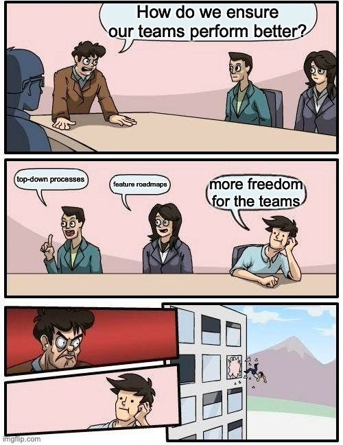

-----

#### 🖥️ 애자일 소프트웨어 개발(Agile Software Development; 애자일 방법론)이란?

> 프로젝트를 작은 단위의 작업과 단계로 나누는 프로젝트 관리 공정·업무를 세부적으로 나눠 진행하기 때문에 팀이 공정의 각 단계에서 관계자의 피드백을 적용하고, 작업을 재평가하고, 신속하게 반복 작업을 실행할 수 있다. 
애자일 소프트웨어 개발은 2000년대 초반부터 현재까지 많은 기술 기업에서 프로젝트 관리 방식으로 중용되어 왔다. 오늘날 대부분의 소프트웨어 개발팀이 애자일 방법론을 어떠한 형태로든 사용하고 있고, 다른 많은 업무 환경에서도 애자일 방법론의 요소를 활용하고 있다.

----

#### 🖥️ 애자일의 유래
애자일이라는 개념은 2000년대 초 소프트웨어 개발자들이 모여 4가지 원칙이 담긴 선언문을 발표한 데서 유래했으며, 그 원칙은 다음과 같다.

1. 공정과 도구보다 개인과 상호 작용 중시
2. 포괄적인 문서보다 작동하는 소프트웨어 중시
3. 계약 협상보다 고객과의 협력 중시
4. 계획을 고수하기보다는 변화에 대응

2001년에 발표된 애자일 선언문에 명시된 이 4가지 가치는 애자일 프로젝트 관리 방식의 바탕이 되었고, 소프트웨어 개발업계에 전면적인 변화를 가져왔다.

이전까지는 소프트웨어 개발 프로젝트에 폭포수 모델이 가장 선호되는 방식으로 여겨졌다. 폭포수 모델은 처음 등장한 1970년대에는 굉장히 획기적이었지만, 프로젝트를 시작하기도 전에 많은 양의 문서를 작성하고 확고한 계획을 세워야 한다는 점이 가장 큰 문제였다. 
업무가 실제로 시작되면 각 팀이, 때로는 서로 고립된 상태에서, 계획을 철저하게 따라야 해 문제가 발생하거나 계획을 변경해야 할 때 이에 적절하게 대응하기가 힘들었다. 
이에 비해 애자일 방법론을 사용하는 팀은 프로젝트를 더 신속하게 시작할 수 있고 문제가 발생하면 이에 적절하게 대응할 수 있으며 고객, 관계자와 함께 계획을 세울 수 있다.

----

#### 🖥️ 애자일 소프트웨어 개발 방법

> 가장 일반적으로 사용되는 방식은 짧은 개발 주기인 '스프린트'를 통해 업무를 점진적으로 진행하는 것이다. 
이를 통해 팀은 업무를 신속하게 진행하고, 스프린트 계획 단계와 매일 진행되는 스크럼을 통해 관리자, 관계자들과 정기적으로 업무를 재평가할 수 있다. 
프로젝트팀과 관계자들은 검토를 거쳐 업무를 현재의 방식대로 계속 진행할 것인지, 아니면 앞으로의 스프린트에서는 계획을 변경해 적용할 것인지 결정할 수 있다.
전통적인 프로젝트 관리 방식과 비교하면 애자일 방법론은 속도, 유연성, 팀워크, 관계자의 요구 사항을 가장 우선순위로 둔다는 점에서 차이가 있다.

-----
출처 :   
https://experience.dropbox.com/ko-kr/resources/agile-methodology