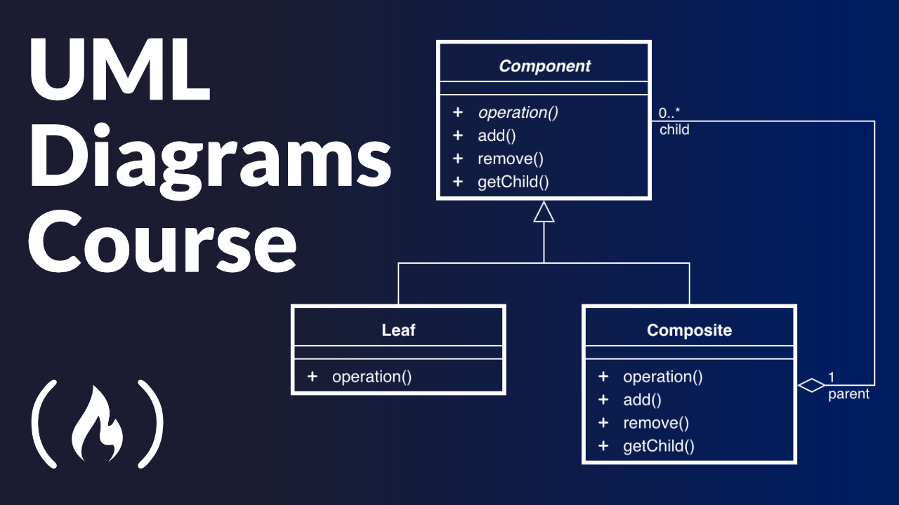
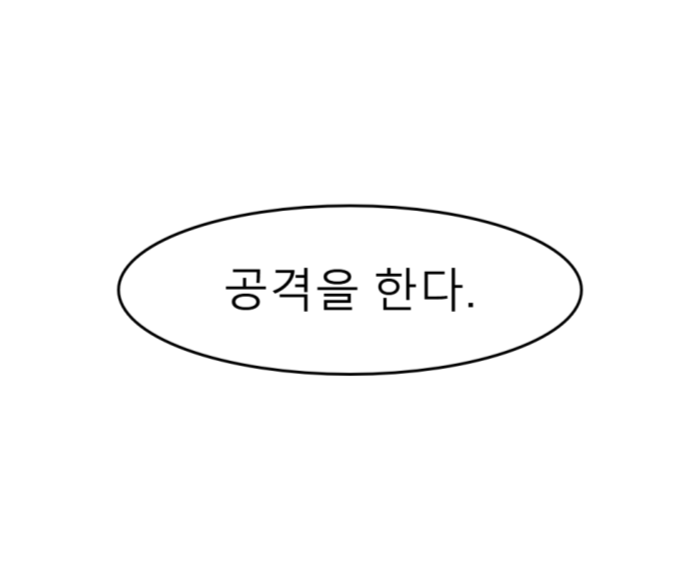
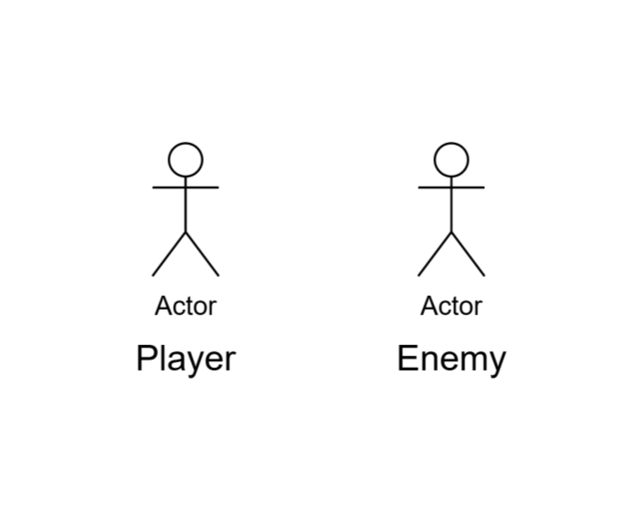
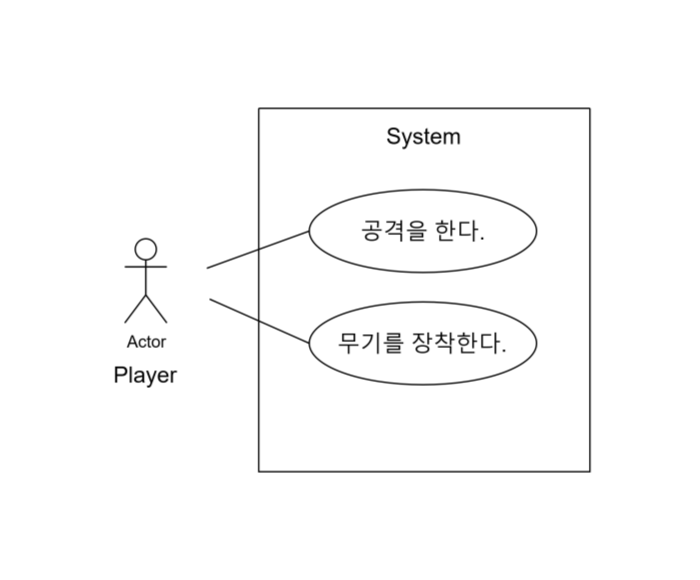
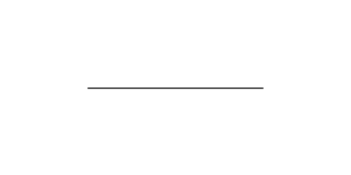
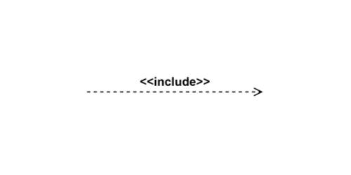
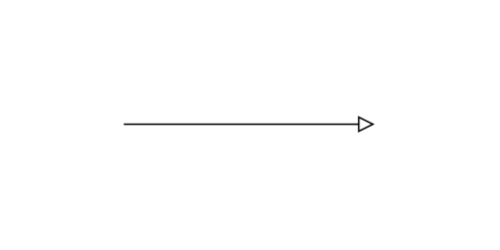
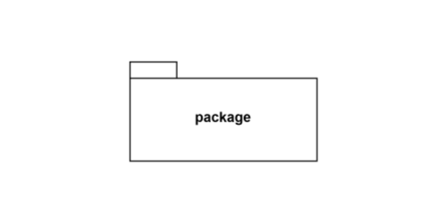

  

-----

이미지 출처 : https://365ok.co.kr/okinfo/8517?sst=wr_datetime&sod=desc&sop=and&page=14

#### 🖥️ UML(Unified Modeling Language, 통합 모델링 언어)이란?

> 통합 다이어그램 세트로 구성된 표준화된 모델링 언어로, 시스템 및 소프트웨어 개발자가 소프트웨어 개발 프로젝트를 진행하면서 시스템에 대한 전체 구조와 기능을 설명하기 위한 다양한 산출물을 생성, 시각화, 문서화 뿐만 아니라 비즈니스 모델링과 기타 비소프트웨어 시스템에도 사용할 수 있도록 개발된 언어.
즉 쉽게 말해, 필요한 시스템을 모델링할 때 사용하는 표준 언어라고 할 수 있다.

----

#### 🖥️ UML의 Use-case

**UML(통합 모델링 언어)**의 행위자(액터)와 액터가 요구하여 **시스템이 수행하는 일의 목표**
  - Use case 다이어그램 : 시스템이 제공하고 있는 기능 및 그와 관련된 외부요소를 사용자의 관점에서 표현하는 다이어그램.

#####  [Use Case의 구성요소]

| 구성요소  | 내용                                                | 표기법                          |
|-----------|-----------------------------------------------------|---------------------------------|
| Use Case  | 시스템이 제공해야 하는 서비스. Actor가 시스템을 통한 일련의 행위 |  |
| Actor (행위자) | 사용자가 시스템에 대해 수행하는 역할(role) 시스템과 상호작용하는 사람 또는 사물 |  |
| 시스템 (System) | 전체 시스템의 영역을 표현 특별한 의미를 가지지 못함 |  |

#####  [Use Case의 구성요소간 관계]

| 관계       | 설명                                                        | 표기법   |
|------------|-------------------------------------------------------------|----------|
| 연관(Association) | Use Case와 Actor의 관계를 표현                             |      |
| 확장(Extend)     | 기본 Use Case 수행 시 특별한 조건을 만족할 때 수행하는 Use Case |         |
| 포함(Include)    | 시스템의 기능이 별도의 기능을 포함                        |     |
| 일반화(Generalization) | 하위 Use Case/Action이 상위 Use Case/Actor에게 기능/역할을 상속 받음 |     |
| 그룹화(Grouping) | 여러 개의 Use Case를 단순화 하는 방법                     |     |

----

#### 🖥️ UML Class Diagram

**시스템에서 사용되는 객체 타입을 정의하고, 그들 간의 존재하는 정적인 관계를 다양한 방식으로 표현한 다이어그램**

----

#### 🖥️ UML Sequence Diagram

**문제 해결에 필요한 객체를 정의하고 객체간 주고받는 메시지의 순서를 시간의 흐름에 따라 보여주는 다이어그램**

-----
출처 :  
＊ https://wikidocs.net/251744 
＊ https://en.wikipedia.org/wiki/Use_case/  
＊ http://www.jidum.com/jidums/view.do?jidumId=976  
＊ http://www.jidum.com/jidums/view.do?jidumId=979  
＊ http://www.jidum.com/jidums/view.do?jidumId=980  
