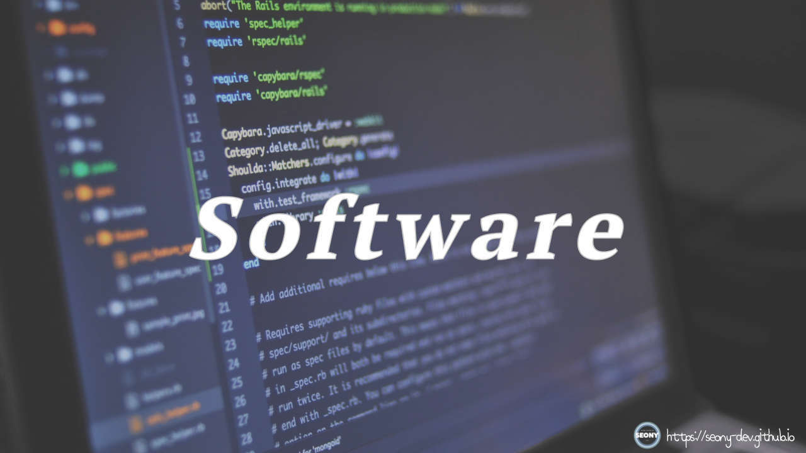

  

-----

#### 🖥️ 소프트웨어(Software, S/W)란?

> 컴퓨터를 비롯한 시스템에서 특정 작업을 수행하게 하는 프로그램의 집합으로 그 수행에 필요한 절차, 규칙, 문서 등의 총칭.  
컴퓨터에서 소프트웨어는 하드웨어(Hardware)를 운용하여 특정 작업을 수행하는 절차와 규칙, 관련 체계 등을 기술한 명령어 집합, 즉 프로그램 집합이다.

----

#### 🖥️ 소프트웨어의 특징

**[프레드릭 브룩스의 정의]**

|  특징 | 설명 |
|-----------|----------------|
| 복잡성(Complexity)  | 개발 과정이 복잡하며 비표준화. |
| 순응성(Conformity)  | 사용자의 요구나 환경 변화에 적절히 변경됨. |
| 변경성(Changeability)  | 필요에 따라 항상 수정이 가능한 진화. |
| 무형성(Intagmible) | 사실상 형체가 없으며, FP(기능점수)등으로 유형화 하고자 함. |
| 복제성(Duplicability) | 적은 비용(무상)으로 간단하고 쉽게 다양한 경로와 노력으로 복제가 가능. |
| 개발(Developed) | 제조(조립)가 아닌, 개발. (developed not manufactured.) |
| 유형성(有形性) | 논리적이며 보고 만질 수 없는 것이 아니라, 프로그램 코드를 인쇄시켜 볼 수도 있고 분석/설계 산출물로 가시화시킬 수 있음. | 
| 동적 행위성(動的行爲性) | 프로그램이 하드웨어로 수행되고, 사용자와 상호작용할 때 비로소 소프트웨어가 됨. (정적 -> 동적) |

**[확장판]**

|  특징 | 설명 |
|-----------|----------------|
| 상품성  | 개발된 소프트웨어는 상품화되어 판매됨. |
| 견고성  | 일부 수정으로 소프트웨어 전체에 영향을 줄 수 있음. |
| 비마모성  | 마모되거나 소멸되지 않음. |
| 비제조성 | 하드웨어처럼 제작이 아니라 논리적인 절차에 맞게 개발. |
| 비과학성 | 과학적이 아니라 조직, 인력, 시간, 절차 등 중심으로 이루어짐. |

-----
출처 :  
＊ https://terms.tta.or.kr/dictionary/dictionaryView.do?word_seq=056146-2  
＊ https://goodgid.github.io/SoftWare-Feature/ 
