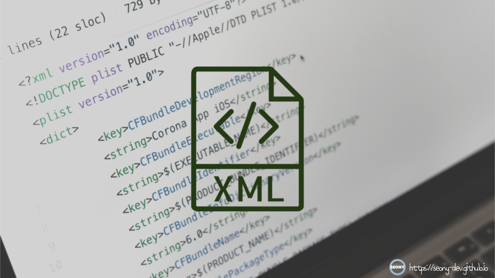

<p align="center">
  
</p>

----

#### 🖥️ XML(eXtensible Markup Language)이란?

> XML은 **eXtensible Markup Language**의 약자로, 데이터를 구조화하고 저장하는 데 사용되는 마크업 언어임. HTML과 유사한 태그(tag) 기반 구조를 가지지만, HTML은 데이터를 **표현**하는 데 집중하는 반면, XML은 데이터를 **정의하고 저장**하는 데 초점이 맞춰져 있음.

----

#### 🖥️ XML의 특징

- **확장 가능성**: 사용자가 원하는 태그를 정의할 수 있음.
- **계층적 구조**: 트리(Tree) 구조로 데이터를 저장하며, 부모-자식 관계를 가짐.
- **데이터 저장 및 전송**: JSON과 유사하게 데이터를 저장하고 전송하는 데 적합함.
- **플랫폼 독립성**: 다양한 시스템 간 데이터 교환이 가능함.
- **가독성**: 사람이 읽기 쉬운 구조로 되어 있음.

#### 🖥️ XML 기본 구조

XML 문서는 루트 요소(root element)를 가지며, 여러 개의 중첩된 요소(element)로 구성됨.

```xml
<?xml version="1.0" encoding="UTF-8"?>
<game>
    <player>
        <name>Player</name>
        <level>6</level>
        <health>120</health>
        <mana>50</mana>
    </player>
    <inventory>
        <item id="1" type="weapon">
            <name>Excalibur</name>
            <damage>50</damage>
        </item>
        <item id="2" type="potion">
            <name>Health Potion</name>
            <heal>30</heal>
        </item>
    </inventory>
</game>
```

&emsp;&emsp;&emsp;&emsp;&emsp;&emsp;&emsp;&emsp;&emsp;&emsp;&emsp;▲ 게임 개발에 활용한 XML 예시

#### 설명

- `<?xml version="1.0" encoding="UTF-8"?>` → XML 선언부 (문서의 버전과 인코딩 지정)
- `<game>` → 최상위 루트 요소
- `<player>` → 플레이어 정보
  - `<name>`, `<level>`, `<health>`, `<mana>` → 플레이어의 속성
- `<inventory>` → 인벤토리 요소
  - `<item>` → 게임 내 아이템 (속성 : `id`, `type`)
  - `<name>`, `<damage>`, `<heal>` → 아이템 속성값 정의

----

#### 🖥️ XML 문법 규칙

- **반드시 루트 요소(root element)를 포함해야 함**
- **태그는 대소문자를 구분함** (예: `<Name>`과 `<name>`은 다름)
- **모든 태그는 닫혀 있어야 함** (`<tag></tag>` 또는 `<tag />`)
- **속성 값은 반드시 큰따옴표("") 또는 작은따옴표('')로 감싸야 함**
- **특수 문자는 엔티티(Entity)로 표현해야 함** (예: `<` → `&lt;`, `>` → `&gt;`)

----

#### 🖥️ XML과 JSON 비교

| 비교 항목 | XML | JSON |
|---------|-----|------|
| 데이터 표현 방식 | 태그 기반 | 키-값 쌍 기반 |
| 가독성 | 사람이 읽기 쉬움 | 더 간결하고 직관적임 |
| 데이터 크기 | 태그로 인해 다소 큼 | 상대적으로 작음 |
| 파싱 속도 | 느림 (DOM 기반) | 빠름 (JavaScript에서 바로 사용 가능) |
| 확장성 | 자유로운 태그 정의 가능 | 키-값 형태로 제한됨 |

----

#### 🖥️ XML의 활용 사례

- **웹 서비스 (SOAP, RSS, Atom 피드)**
- **설정 파일 (config.xml, AndroidManifest.xml)**
- **데이터 저장 및 교환 (데이터베이스, API 응답)**
- **문서 구조 정의 (XHTML, SVG, XSLT)**

----

