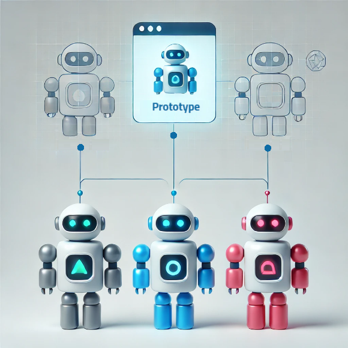

<p align="center">
  
</p>

----

#### 🖥️ 프로토타입 패턴(Prototype Pattern)이란?

> 객체를 생성할 때, 매번 새로운 인스턴스를 만드는 대신 기존 객체를 복사(clone)하여 생성하는 패턴을 의미함. 생성 비용이 크거나 객체 구성이 복잡할 때 유용하게 사용됨.

----

#### 🖥️ 프로토타입 패턴 동작 방식

1. **프로토타입 인터페이스 정의** : 복제를 수행할 메서드를 선언함.
2. **구체적인 프로토타입 클래스 구현** : 복제 메서드를 실제로 구현하여 객체를 복사할 수 있도록 만듦.
3. **클라이언트에서 복제 사용** : 기존 객체를 복제하여 새로운 인스턴스를 생성함.

----

#### 🖥️ 프로토타입 패턴 장·단점

| 장점                                               | 단점                                                      |
| ------------------------------------------------ | ------------------------------------------------------- |
| **객체 생성 비용 절감**: 복잡한 객체를 처음부터 생성하는 비용을 줄일 수 있음.  | **깊은 복사와 얕은 복사의 문제**: 복제 방식에 따라 내부 객체의 참조 문제가 발생할 수 있음. |
| **유연성 증가**: 기존 객체를 기반으로 변형하여 새로운 객체를 쉽게 만들 수 있음. | **추적 어려움**: 복제된 객체가 원본과 어떻게 다른지 추적하기 어려울 수 있음.          |
| **캡슐화 유지**: 객체 생성 로직을 감출 수 있어 코드의 유지보수성이 높아짐.    |                                                         |

----

#### 🖥️ 프로토타입 패턴 코드 예제 (C++)

```cpp
#include <iostream>
#include <stdio.h>
using namespace std; 

class Prototype 
{
public:
    virtual Prototype* clone() const = 0; //복제 메서드 '선언'
    virtual void show() const = 0; //객체 정보 출력 
    virtual ~Prototype() {}
};

class ConcretePrototype : public Prototype 
{
private:
    int value; 
public:
    ConcretePrototype(int val) 
     : value(val) {} //생성자 - 멤버 변수 초기화
    
    //복제 메서드 '구현' - 깊은 복사
    ConcretePrototype* clone() const override 
    {
        return new ConcretePrototype(*this);
    }
    
    void show() const override 
    {
        printf("ConcretePrototype's value = %d", value);
    }
};

int main() 
{
    
    //원본 객체 생성
    ConcretePrototype* obj1 = new ConcretePrototype(42);
    
    //객체 복제
    ConcretePrototype* obj2 = obj1->clone();
    
    //복제된 객체 출력
    obj1->show(); //-> ConcretePrototype's value = 42
    obj2->show(); //-> ConcretePrototype's value = 42
    
    delete obj1;
    delete obj2;
    
    return 0;
}
```

----

#### 🖥️ 프로토타입 패턴 활용 사례

- 데이터베이스에서 객체를 불러와 여러 개의 유사한 객체를 생성할 때
- 복잡한 객체를 초기화하는 비용이 클 때
- 런타임에 객체 구성을 변경해야 할 때

